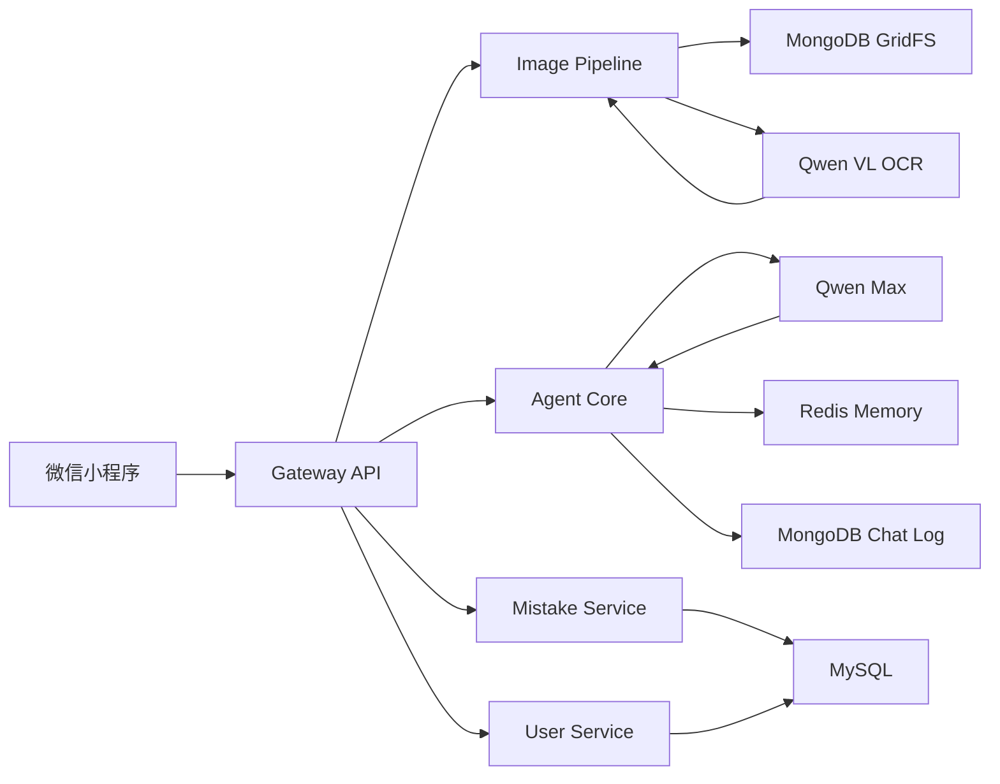

<div align="center">

# 📸 Solving-problems-Agent

### 一个面向学习场景的 AI 拍照解题助手

把题目拍下来，交给 Agent 自动完成 **图片识别 → 题目清洗 → 智能解答 → 错题沉淀 → 复习推荐**。

<p>
  
  
  
  
  
  
</p>

</div>

---

## ✨ 项目简介

**Solving-problems-Agent / AgentDome** 是一个基于 Spring Boot 和大模型能力构建的 AI 解题系统，主要面向算法竞赛、数学学习、考研 408 等学习场景。

项目采用 **Maven 多模块架构**，后端负责用户认证、图片处理、OCR 识别、Agent 解题、错题集管理和聊天历史沉淀；前端采用微信小程序，提供聊天、错题集和个人中心等页面。

核心目标不是简单地“调用大模型回答问题”，而是把学习过程拆成完整闭环：

> 拍照上传 → OCR 识别 → 文本清洗 → Agent 解题 → 错题收藏 → 历史会话 → 后续复习

---

## 🚀 核心功能

### 📷 拍照识题

- 支持微信小程序上传题目图片
- 后端接收 Multipart 文件
- 图片存储到 MongoDB GridFS
- 调用 Qwen-VL-OCR 提取图片中的题目文本
- 对 OCR 文本进行清洗，减少识别噪声

### 🧠 AI 智能解题

- 接入阿里云 DashScope / Qwen-Max
- 支持同步回答和流式输出
- 根据题目类型自动构造 Prompt
- 当前支持：
  - ACM / 算法竞赛题
  - 数学题
  - 通用题目问答

### 🧩 Agent 工具调用

Agent 不只是聊天，还可以根据用户意图调用不同工具：

- 解题工具：生成思路、算法分析、代码和复杂度
- 错题工具：加入错题、查询错题、删除错题、清空错题
- 推荐工具：推荐相似题目
- 概念解释工具：解释知识点和核心概念
- 聊天记录工具：查询、删除、清空历史会话

### 📚 错题集管理

- 支持把最近解答过的题加入错题本
- 支持查询错题列表
- 支持查看指定错题详情
- 支持删除指定错题
- 为后续个性化复习和相似题推荐做数据沉淀

### 💬 会话记忆

- 使用 Redis 管理短期会话上下文
- 使用 MongoDB 保存聊天历史
- 支持创建新会话、查看会话列表、查看会话详情、删除会话
- 支持跨会话学习摘要，为后续个性化解题做准备

### 👤 用户认证

- 微信小程序登录
- 游客登录
- Web 注册 / 登录
- JWT Token 鉴权

---

## 🏗️ 系统架构



---

## 📦 模块说明

```text
Solving-problems-Agent
├── common             # 公共实体、Repository、配置、异常、JWT 工具
├── user-service       # 用户登录、微信认证、用户信息管理
├── image-pipeline     # 图片上传、GridFS 存储、OCR 识别、文本清洗
├── mistake-service    # 错题集、标签、错题查询与删除
├── agent-core         # Agent 编排、Qwen 调用、工具路由、会话记忆
├── gateway            # HTTP API、鉴权入口、Controller、启动类
├── miniprogram        # 微信小程序端：聊天、错题集、个人中心
├── docs               # 项目计划与开发文档
├── docker-compose.yml # MySQL、Redis、MongoDB 本地开发环境
└── pom.xml            # Maven 父工程
```

---

## 🛠️ 技术栈

### 后端

| 技术 | 作用 |
|---|---|
| Java 17 | 后端主要开发语言 |
| Spring Boot 3.3.0 | Web 服务与应用启动 |
| Maven Multi-Module | 多模块项目管理 |
| Spring Web / WebSocket | REST API 与实时交互扩展 |
| Spring Data JPA | MySQL 数据访问 |
| Spring Security + JWT | 登录认证与接口鉴权 |
| LangChain4j | Agent 能力集成基础 |
| DashScope SDK | Qwen-Max 大模型调用 |
| Qwen-VL-OCR | 图片文字识别 |
| MySQL 8 | 用户、题目、错题等结构化数据 |
| Redis 7 | 会话短期记忆 |
| MongoDB 7 | 图片、聊天记录、历史摘要 |

### 前端

| 技术 | 作用 |
|---|---|
| 微信小程序原生开发 | 移动端交互入口 |
| WXML / WXSS / JS | 页面结构、样式和逻辑 |
| wx.request / wx.uploadFile | 接口调用和图片上传 |

---

## ⚙️ 本地启动

### 1. 克隆项目

```bash
git clone https://github.com/DGKL05/Solving-problems-Agent.git
cd Solving-problems-Agent
```

### 2. 启动基础环境

项目提供了 `docker-compose.yml`，可以一键启动 MySQL、Redis、MongoDB：

```bash
docker compose up -d
```

默认启动端口：

| 服务 | 端口 | 说明 |
|---|---:|---|
| MySQL | 3306 | 默认数据库 `agent_dome` |
| Redis | 6379 | 会话记忆 |
| MongoDB | 27017 | 图片与聊天记录 |

### 3. 配置环境变量

#### Windows PowerShell

```powershell
$env:MYSQL_HOST="localhost"
$env:MYSQL_USER="root"
$env:MYSQL_PASSWORD="root"
$env:DASHSCOPE_API_KEY="你的 DashScope API Key"
$env:JWT_SECRET="please-change-this-secret-to-a-long-random-string"
```

#### macOS / Linux

```bash
export MYSQL_HOST=localhost
export MYSQL_USER=root
export MYSQL_PASSWORD=root
export DASHSCOPE_API_KEY="你的 DashScope API Key"
export JWT_SECRET="please-change-this-secret-to-a-long-random-string"
```

> 注意：`docker-compose.yml` 中 MySQL root 密码默认为 `root`，所以本地启动时建议显式设置 `MYSQL_PASSWORD=root`。

### 4. 编译项目

```bash
mvn clean package -DskipTests
```

### 5. 启动后端网关

```bash
mvn -pl gateway spring-boot:run
```

启动成功后访问：

```text
GET http://localhost:8080/api/health
```

正常返回：

```json
{
  "code": 0,
  "data": "AgentDome running",
  "message": "success"
}
```

---

## 📱 启动微信小程序

1. 打开微信开发者工具
2. 导入 `miniprogram/` 目录
3. 确认 `miniprogram/app.js` 中的后端地址：

```js
baseUrl: 'http://localhost:8080'
```

4. 启动后端服务
5. 在小程序中进入聊天页，上传题目图片进行测试

---

## 🔌 主要接口

### 健康检查

```http
GET /api/health
```

### 用户认证

```http
POST /api/auth/login       # 微信登录
POST /api/auth/guest       # 游客登录
POST /api/auth/register    # Web 注册
POST /api/auth/web-login   # Web 登录
```

### 拍照上传

```http
POST /api/chat/upload
Content-Type: multipart/form-data
```

参数：

| 参数 | 类型 | 说明 |
|---|---|---|
| file | File | 题目图片 |
| subjectType | String | 题目类型，例如 ACM / MATH |
| sessionId | String | 当前会话 ID |

返回示例：

```json
{
  "code": 0,
  "data": {
    "imageId": "665f...",
    "cleanedText": "题目识别后的文本",
    "subjectType": "ACM"
  },
  "message": "success"
}
```

### 聊天会话

```http
POST   /api/chat/sessions
GET    /api/chat/sessions
GET    /api/chat/sessions/{sessionId}
DELETE /api/chat/sessions/{sessionId}
```

### 错题集

```http
GET    /api/mistakes
DELETE /api/mistakes/{id}
```

### 题目详情

```http
GET /api/problems/{id}
```

---

## 🧪 快速测试流程

1. 启动 Docker 基础环境
2. 配置 `DASHSCOPE_API_KEY`
3. 启动 `gateway` 模块
4. 调用 `/api/auth/guest` 获取 Token
5. 调用 `/api/chat/sessions` 创建会话
6. 使用 `/api/chat/upload` 上传题目图片
7. 查看返回的 `cleanedText`
8. 在小程序端继续进行解题、错题集和会话管理测试

---

## 🧠 Prompt 能力设计

当前 Agent 会根据 `subjectType` 构造不同提示词：

### ACM 模式

- 分析题目类型
- 识别算法方向
- 给出解题思路
- 输出 C++ 代码
- 分析时间复杂度和空间复杂度

### MATH 模式

- 判断数学概念
- 给出分步推导
- 解释每一步原理
- 使用 `\boxed{}` 标注最终答案

---

## 🗺️ Roadmap

- [x] Maven 多模块项目骨架
- [x] Gateway 统一入口
- [x] JWT 用户认证
- [x] 微信小程序基础页面
- [x] 图片上传与 OCR 识别
- [x] Qwen-Max 智能解题
- [x] 聊天历史保存
- [x] 错题集查询与删除
- [ ] 图片上传后自动进入完整解题链路
- [ ] 增加 408 专项 Prompt：数据结构、计组、操作系统、计网
- [ ] 增加错题标签自动生成
- [ ] 增加相似题推荐算法
- [ ] 增加后台管理页面
- [ ] 增加接口文档 Swagger / Knife4j
- [ ] 增加 Dockerfile 与一键部署脚本

---

## 📌 项目亮点

- **不是简单 ChatBot**：围绕学习场景设计了 OCR、Agent、错题、会话记忆的完整闭环。
- **多模块后端架构**：按用户、图片、Agent、错题、网关进行职责拆分，便于后续扩展。
- **真实大模型接入**：使用 Qwen-Max 进行题目解答，使用 Qwen-VL-OCR 进行图片识别。
- **适合简历展示**：覆盖 Spring Boot、JWT、MySQL、Redis、MongoDB、AI Agent、微信小程序等多个技术点。
- **可继续工程化**：后续可以扩展 RAG、Tool Calling、题库推荐、学习画像和部署流水线。

---

## 👨‍💻 作者

**DGKL05**

- GitHub: [@DGKL05](https://github.com/DGKL05)
- Project: [Solving-problems-Agent](https://github.com/DGKL05/Solving-problems-Agent)

---

<div align="center">

如果这个项目对你有帮助，欢迎 Star ⭐

</div>
